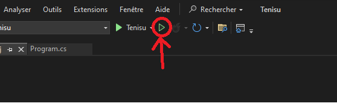

# Tenisu
A Tenis basic Web API realized in ASP .NET

## How to run it

1. Open the Tenisu.sln file with Visual Studio 2022.

2. Click on the play button to run it

3. Add /swagger at the end of the opened URL to see the differents routes.